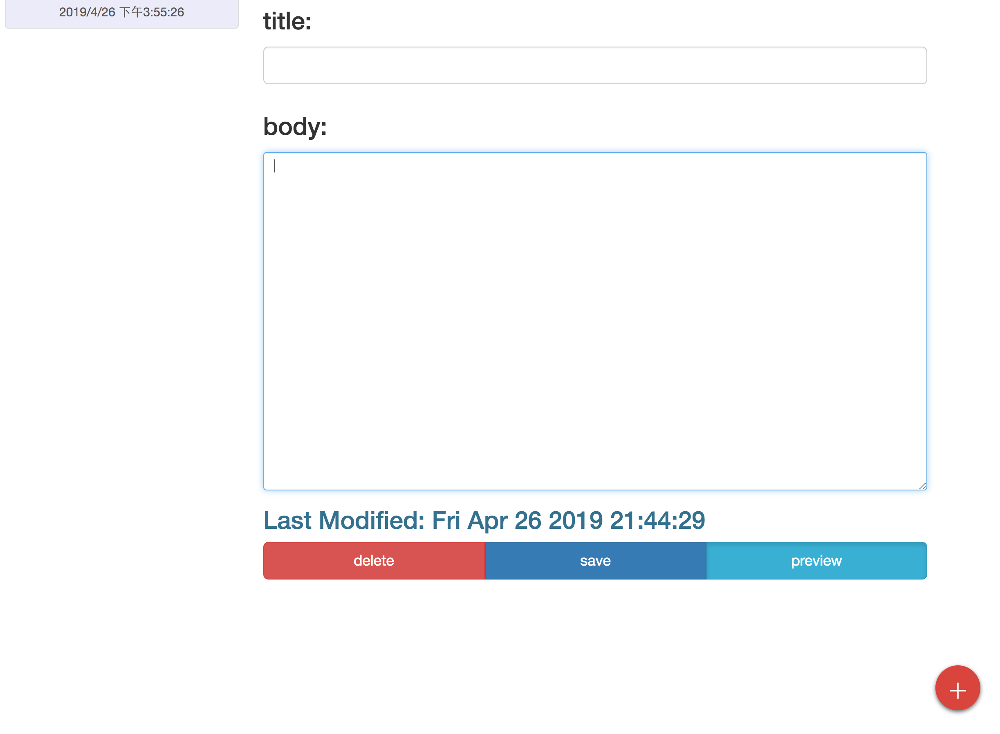
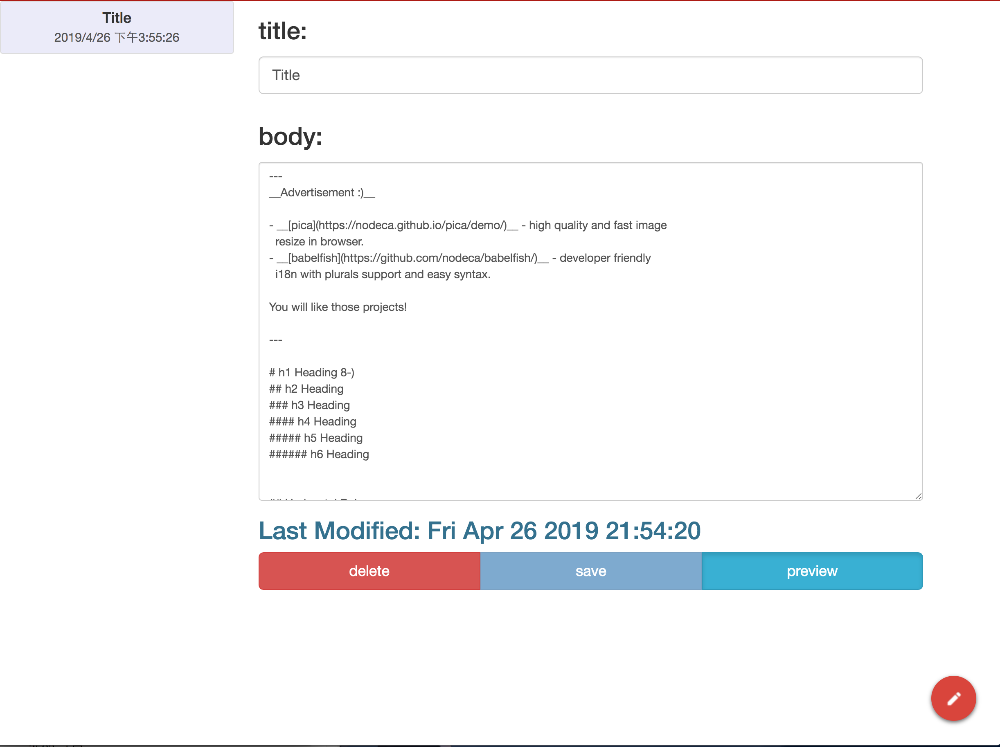
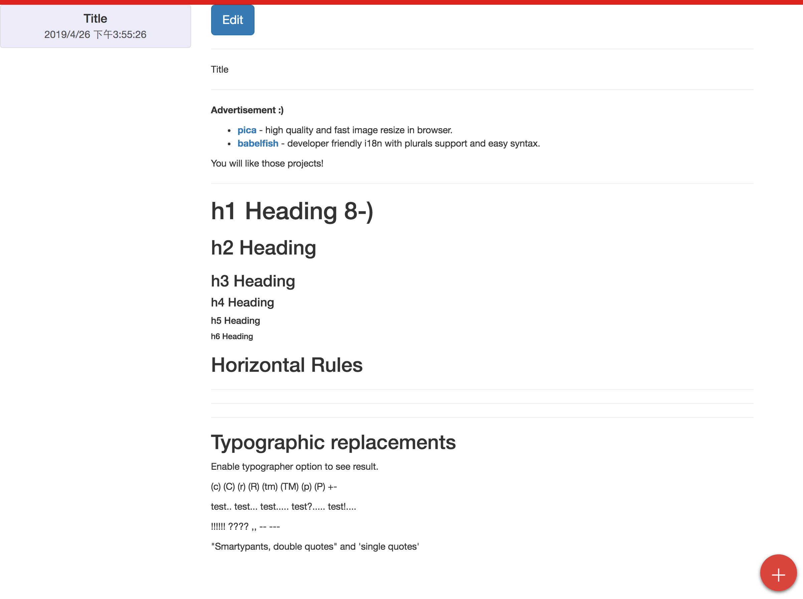

# Web Application Projects

Project1: Warm Up on Java MySQL Docker

Project2: Tomcat-Based Markdown Editor using Java Servlet, JSP, JDBC 

Project3: Markdown Editor Using Angular

Project4: Blogging Server on Node.js and MongoDB 

Github page is set up for Project3 as demonstration:

 [https://redhairdragon.github.io/WebApplicationProjects](https://redhairdragon.github.io/WebApplicationProjects/)/

Click on + button to Add Post

Click Preview to see the markdown version

